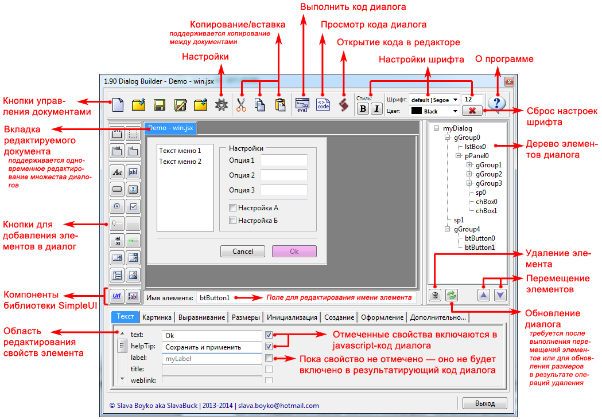

# ExtendScript DialogBuilder
***Status:*** *В разработке...* | ***Version:*** *1.90* | ***Last update:*** *22.08.2014*

Дизанер и конструктор диалоговых окон для **Adobe ExtendScript© & InDesign©**, написан на чистом **JavaScript** (**ExtendScript**).



### Основные возможности
* Генерация корректного javascript-кода для редактируемого макета диалога с возможностью его сохранения в пользовательский файл документа  (файл сценария с расширением .jsx), последующего  открытия и доработки ранее сохранённых результатов;
* Поддерживается полноценный  многодокументный интерфейс — одновременная работа с несколькими документами с возможностью копирования и перемещения элементов диалога между разными окнами документов;
* Работа с макетом диалога реализована в режиме «LiveUpdate», при котором редактирование свойств компонентов сразу отражается на их графическом представлении в макете. Такой подход позволяет на каждом шаге работы с макетом видеть фактический результат своих настроек и получать требуемый результат с минимальными трудозатратами;
* Поддерживаются клавиатурные сокращения (корректная работа с клавиатурными сокращениями возможна только при закрытом  редакторе ESTK, в противном случае он производит перехват нажатия “горячих клавиш”);
* Поддерживается возможность управления пользовательскими наборами шрифтов и цветов, которые могут быть сохранены в настройках приложения и использованы повторно;
* Реализована возможность интеграции графической библиотеки SimpleUI с пользовательскими файлами сценариев, а также использование расширенного набора графических компонентов в диалоговых окнах (подробности в справочной документации к библиотеке SimpleUI Guide.pdf, см. https://github.com/SlavaBuck/Includes/tree/master/SimpleUI);
* Поддерживается полная локализации интерфейса. Список доступных языков находится в соответствующем пункте настроек приложения, по умолчанию определение языка интерфейса происходит автоматически на основе текущего значения локали целевой системы.

#### Планируется в следующих версиях:
* Групповое выделение и выполнение групповых операций с объектами пользовательского интерфейса в документе;
* Поддержка предустановленных наборов из групп элементов управления для быстрого формирования диалогов на основе типовых шаблонов, использования мастеров для их создания;
* Расширение возможностей по настройке объектов списков (ListBox, DropDownList, TreeView) и работы с изображениями в рамках объекта диалога:
	* конвертация и включение изображений в тело скрипта; 
	* настройка масштабирования изображений  в пользовательских элементах управления;
	* Работа с массивами изображений для элементов, поддерживающих мультисостояния (IconButton/toolbutton и т.п.);
	* реализация работы с многоколоночными списками и включением изображений в списки;
	* привязка списков к источникам данных;
	* реализация более широких возможностей по редактированию элемента управления TreeView;
* Улучшение совместимости с последними версиями пакета Adobe Creative Cloud и реализация совместимости с операционной системой MacOS.

### Установка
**DialogBuilder** базируется на библиотеках **ExtendScript**, представленных в отдельном [репозитории](https://github.com/SlavaBuck/Includes). В [данном](https://github.com/SlavaBuck/DialogBuilder/archive/master.zip) репозитории содержиться две папки ***./DBuilder*** и ***./src***. Последняя скомпилированная рабочая версия находится в папке ***./DBuilder***. Для использования программы достаточно поместить папку *./DBuilder* в папку со скриптами **InDesign** и с палитры скриптов запустить файл *DBuilder.jsx* (чтобы файлы были видны в палитре скриптов InDesign, их можно расспаковать в папку *C:\Program Files (x86)\Adobe\Adobe InDesign CS6\Scripts\Scripts Panel\* - справедливо для win7 & InDesign CS6):

[](http://youtu.be/i6P0OuBvmqI)

Для работы с исходниками необходимо дополнительно скачать [библиотеки](https://github.com/SlavaBuck/Includes) и в файле *./src/02application.jsx* прописать к ним путь:

```js
/* *************************************************************************
 *  02application.jsx
 *  DESCRIPTION: BuilderApplication: Основной класс приложения 
 *  @@@BUILDINFO@@@ 02application.jsx 1.90 Fri Aug 22 2014 18:12:30 GMT+0300
 * 
 * NOTICE: 
 * 
/* *************************************************************************
 * © Вячеслав aka SlavaBuck, 10.02.2014.  slava.boyko#hotmail.com
 */

// #includepath нужно настроить на папку с библиотеками
#includepath "../../Includes/"
```

Подробности в [руководстве пользователя](DBuilder/doc/DialogBuilder%20-%20User%20Guide.pdf).

----------------------------------
**Copyright:** © Вячеслав aka Buck, 2014. <slava.boyko@hotmail.com>

**License:** <a rel="license" href="http://creativecommons.org/licenses/by-nc-sa/4.0/"></a><br />Произведение «<span xmlns:dct="http://purl.org/dc/terms/" property="dct:title">DialogBuilder</span>» созданное автором по имени <a xmlns:cc="http://creativecommons.org/ns#" href="https://github.com/SlavaBuck/DialogBuilder" property="cc:attributionName" rel="cc:attributionURL">Slava Boyko</a>, публикуется на условиях <a rel="license" href="http://creativecommons.org/licenses/by-nc-sa/4.0/">лицензии Creative Commons «Attribution-NonCommercial-ShareAlike» («Атрибуция — Некоммерческое использование — На тех же условиях») 4.0 Всемирная</a>.

**РУС:** РАЗРЕШЕНО СВОБОДНОЕ ИСПОЛЬЗОВАНИЕ ПРОИЗВЕДЕНИЯ, ПРИ УСЛОВИИ УКАЗАНИЯ ЕГО АВТОРА, НО ТОЛЬКО В НЕКОММЕРЧЕСКИХ ЦЕЛЯХ. ТАКЖЕ ВСЕ ПРОИЗВОДНЫЕ ПРОИЗВЕДЕНИЯ, ДОЛЖНЫ РАСПРОСТРАНЯТЬСЯ ПОД ЛИЦЕНЗИЕЙ CC BY-NC-SA.

**ENG:** THE WORK (AS DEFINED BELOW) IS PROVIDED UNDER THE TERMS OF THIS CREATIVE COMMONS PUBLIC LICENSE (''CCPL'' OR ''LICENSE''). THE WORK IS PROTECTED BY COPYRIGHT AND/OR OTHER APPLICABLE LAW. ANY USE OF THE WORK OTHER THAN AS AUTHORIZED UNDER THIS LICENSE OR COPYRIGHT LAW IS PROHIBITED.
